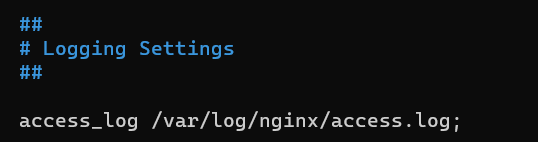
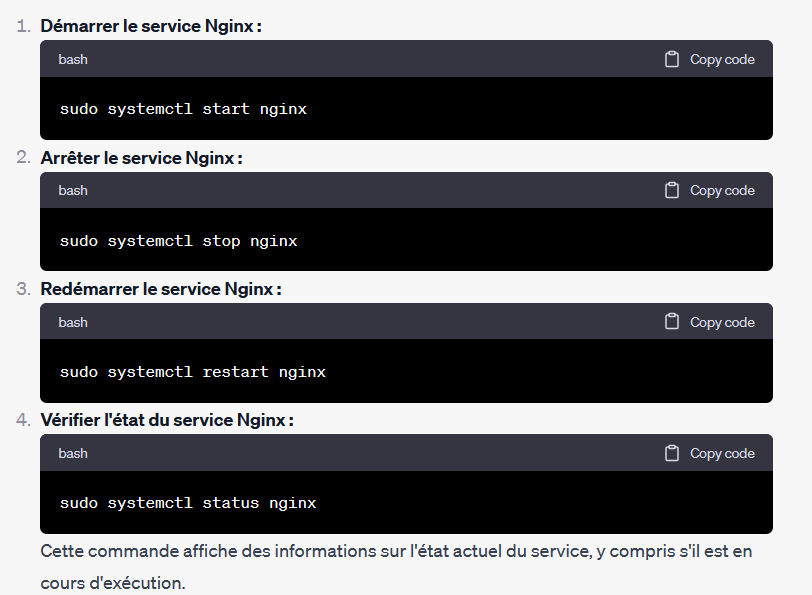
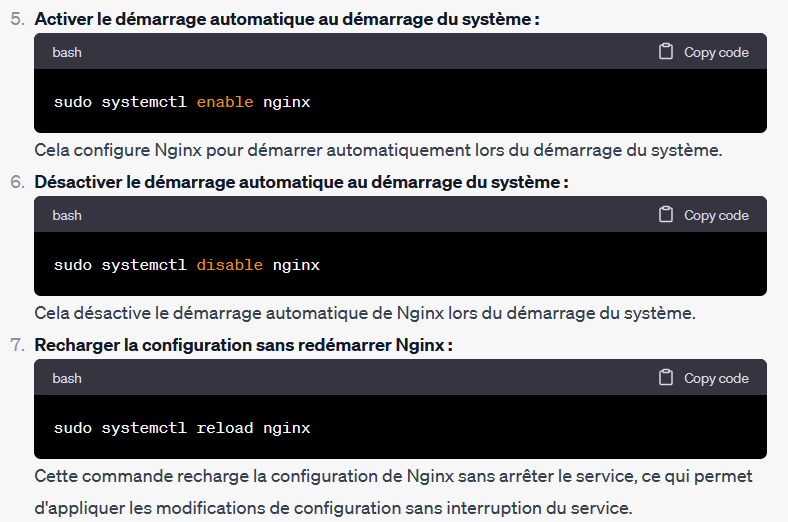

# Installer un serveur Nginx sous Debian

## Définition

Nginx (prononcé "Engine-X") est un serveur web open-source utilisé pour
héberger des sites web et gérer les requêtes HTTP. Sous Debian, Nginx
est souvent utilisé comme alternative à d'autres serveurs web tels
qu'Apache en raison de sa légèreté et de sa performance élevée. Il peut
également être utilisé comme proxy inverse pour rediriger le trafic vers
 différentes applications web. En résumé, Nginx sous Debian est un
logiciel qui permet de servir des pages web de manière efficace et
rapide.

## Origine de Nginx

* **2004 :** Nginx a été créé par Igor Sysoev, un ingénieur russe. L'objectif initial était de résoudre les problèmes de performance associés aux serveurs Web traditionnels lors de la manipulation de nombreuses connexions simultanées.
* **2005 :** La première version publique, Nginx 0.1.0, a été publiée en octobre 2005.
* **2011 :** Nginx a gagné en popularité en tant que serveur Web léger et performant, devenant un concurrent sérieux pour d'autres serveurs Web tels qu'Apache.
* **2012 :** Nginx a atteint le statut de deuxième serveur Web le plus populaire au monde en termes de sites actifs, selon les statistiques de Netcraft.
* **2015 :** Nginx a annoncé que plus de 30% des sites Web mondiaux utilisaient Nginx, confirmant sa position dominante dans l'espace des serveurs Web.
* **2018 :** F5 Networks a acquis Nginx Inc., la société derrière le développement de Nginx, pour environ 670 millions de dollars. Cependant, Nginx continue d'être développé en tant que projet open source.
* **2021 :** Nginx est toujours largement utilisé dans le monde entier, tant pour servir des sites Web statiques que pour agir en tant que proxy inverse et équilibreur de charge dans des architectures Web modernes.

Nginx est apprécié pour sa conception légère, sa haute performance, sa gestion efficace des connexions simultanées et son extensibilité. Il est utilisé par de nombreux grands sites Web et entreprises pour gérer leur trafic Web de manière efficace.

## installation

se connecter  en mode terminal sur votre serveur DEBIAN

* vous pouvez utiliser le logiciel putty ou kitty
* depuis l'invite de commande de windows (ou en powershell)):  ssh root@adresse_ip_de_votre_serveur
* depuis le shell de MACOS ou de LINUX : ssh root@adresse_ip_de_votre_serveur

puis lancer  la commande 

  $ apt update

ceci afin de mettre à jour la liste des logiciels disponibles sur les serveurs de repository ( /etc/apt/sources.list )

$ apt install nginx

téléchargement et installation du paquet NGINX 

## controle du service 

`root@debian:~# `

votre service nginx apparait avec le sigle + ( service en cours de fonctionnement )

## fichier de configuration

les fichiers de configuration se trouvent dan le dossier /etc/nginx

voici  l'arborescence

`root@debian:/etc/nginx# tree
.
├── conf.d
├── fastcgi.conf
├── fastcgi_params
├── koi-utf
├── koi-win
├── mime.types
├── modules-available
├── modules-enabled
├── nginx.conf
├── proxy_params
├── scgi_params
├── sites-available
│   └── default
├── sites-enabled
│   └── default -> /etc/nginx/sites-available/default
├── snippets
│   ├── fastcgi-php.conf
│   └── snakeoil.conf
├── uwsgi_params
└── win-utf`

`root@debian:/etc/nginx# ls -l
total 68
drwxr-xr-x  2 root root 4096 14 mars   2023 conf.d
-rw-r--r--   1 root root 1125 14 mars    2023 fastcgi.conf
-rw-r--r--   1 root root 1055 14 mars    2023 fastcgi_params
-rw-r--r--   1 root root 2837 14 mars    2023 koi-utf
-rw-r--r--   1 root root 2223 14 mars    2023 koi-win
-rw-r--r--   1 root root 4338 14 mars    2023 mime.types
drwxr-xr-x 2 root root 4096  14 mars  2023 modules-available
drwxr-xr-x 2  root root 4096 14 mars  2023 modules-enabled
-rw-r--r--   1 root root 1446  14 mars   2023 nginx.conf
-rw-r--r--   1 root root  180   14 mars    2023 proxy_params
-rw-r--r--   1 root root  636   14 mars    2023 scgi_params
drwxr-xr-x 2  root root 4096  9 oct.   11:35 sites-available
drwxr-xr-x 2  root root 4096  2 oct.  16:49 sites-enabled
drwxr-xr-x 2  root root 4096  2 oct.  16:49 snippets
-rw-r--r--  1  root root  664 14 mars   2023 uwsgi_params
-rw-r--r--  1  root root 3071 14 mars   2023 win-utf`

voici un point sur les principaux fichiers 

Le répertoire `/etc/nginx/conf.d` sous Nginx est généralement utilisé pour stocker des fichiers de configuration supplémentaires. Ces fichiers contiennent des configurations spécifiques à des sites, applications ou services particuliers, et sont inclus dans la configuration principale du serveur Nginx. En d'autres termes, plutôt que de mettre toutes les configurations dans le fichier principal `nginx.conf`, vous pouvez les organiser en fichiers distincts dans le répertoire `/etc/nginx/conf.d`. Cela facilite la gestion et la modularité de la configuration, surtout lorsque vous avez plusieurs sites ou services à gérer.

Le fichier `fastcgi.conf` sous Nginx est un fichier de configuration par défaut qui contient des directives spécifiques au module FastCGI. FastCGI est un protocole de communication entre un serveur web et un programme externe qui gère des requêtes pour générer des contenus dynamiques. Le fichier `fastcgi.conf` est souvent inclus dans la configuration principale de Nginx (`nginx.conf`) pour définir des paramètres globaux liés au module FastCGI. Par exemple, il peut contenir des configurations telles que le timeout FastCGI, la gestion des connexions, les en-têtes FastCGI, etc.

Le fichier `fastcgi_params` est un autre fichier de configuration associé au module FastCGI dans Nginx. Ce fichier est souvent inclus dans les configurations FastCGI pour définir des paramètres communs utilisés lors de la communication avec des serveurs FastCGI. Le contenu typique du fichier `fastcgi_params` comprend des directives qui définissent des variables d'environnement FastCGI telles que `SCRIPT_FILENAME`, `QUERY_STRING`, `REQUEST_METHOD`, etc. Ces variables sont ensuite utilisées par le serveur FastCGI pour traiter les requêtes.

Le répertoire `sites-available` est un répertoire utilisé par  certains systèmes basés sur Debian, comme Ubuntu, pour stocker les fichiers de configuration des sites Nginx qui sont disponibles mais pas activés par défaut. Il s'agit d'une pratique courante dans la gestion des configurations de serveur web. Le modèle est conçu pour permettre aux administrateurs de gérer facilement les configurations des sites, en les activant ou désactivant
au besoin. Lorsqu'un site est activé, un lien symbolique est créé dans le répertoire `sites-enabled`, pointant vers le fichier de configuration dans le répertoire `sites-available`.

Le fichier `nginx.conf` est le fichier de configuration principal de Nginx. Il contient les configurations globales pour le serveur Nginx, y compris les paramètres tels que les options de démarrage, les répertoires de fichiers de log, les paramètres de performance, et d'autres configurations qui s'appliquent à l'ensemble du
 serveur.

Dans NGINX , le répertoire `modules-available`  n'est pas utilisé. Dans Nginx, les modules sont des composants logiciels qui étendent les fonctionnalités de base du serveur. Nginx est modulaire par conception, ce qui signifie que vous pouvez ajouter ou supprimer des modules en fonction de vos besoins spécifiques. Les modules peuvent être intégrés directement dans le binaire Nginx lors de la compilation ou activés
dynamiquement lors de l'exécution. Les modules Nginx couvrent une gamme de fonctionnalités, notamment le support de différents protocoles, la gestion des requêtes HTTP, la compression, l'équilibrage de charge, la gestion des fichiers statiques.

## les fichiers de logs

les fichiers de logs se trouvent dans le dosier /var/etc/nginx

`root@debian:/var/log/nginx# ls -l
total 76
-rw-r----- 1 www-data adm     0 13 nov.  21:03 access.log
-rw-r----- 1 www-data adm 37374 10 oct.  12:47 access.log.1
-rw-r----- 1 www-data adm  1627  9 oct.  11:53 access.log.2.gz
-rw-r----- 1 www-data adm  1196  5 oct.  16:57 access.log.3.gz
-rw-r----- 1 www-data adm     0 13 nov.  21:03 error.log
-rw-r----- 1 www-data adm 15539 10 oct.  11:53 error.log.1
-rw-r----- 1 www-data adm   458  9 oct.  11:50 error.log.2.gz
-rw-r----- 1 www-data adm    93  2 oct.  16:49 error.log.3.gz
root@debian:/var/log/nginx#`

on retrouve ce paramétre dans le fichier nginx.conf 

ou dans  chaque fichier de paramètrage des virtualhost

ces fichiers permettent de connaitre l'activiter du service web ( application awstats ou webalizer par exemple ) )  et de voir les erreurs eventuelles générées par le service : error.log

Gestion du service

Pour gérer le service Nginx sous Debian (ou d'autres distributions basées sur Debian, comme Ubuntu), vous pouvez utiliser le gestionnaire de services `systemctl`. 

